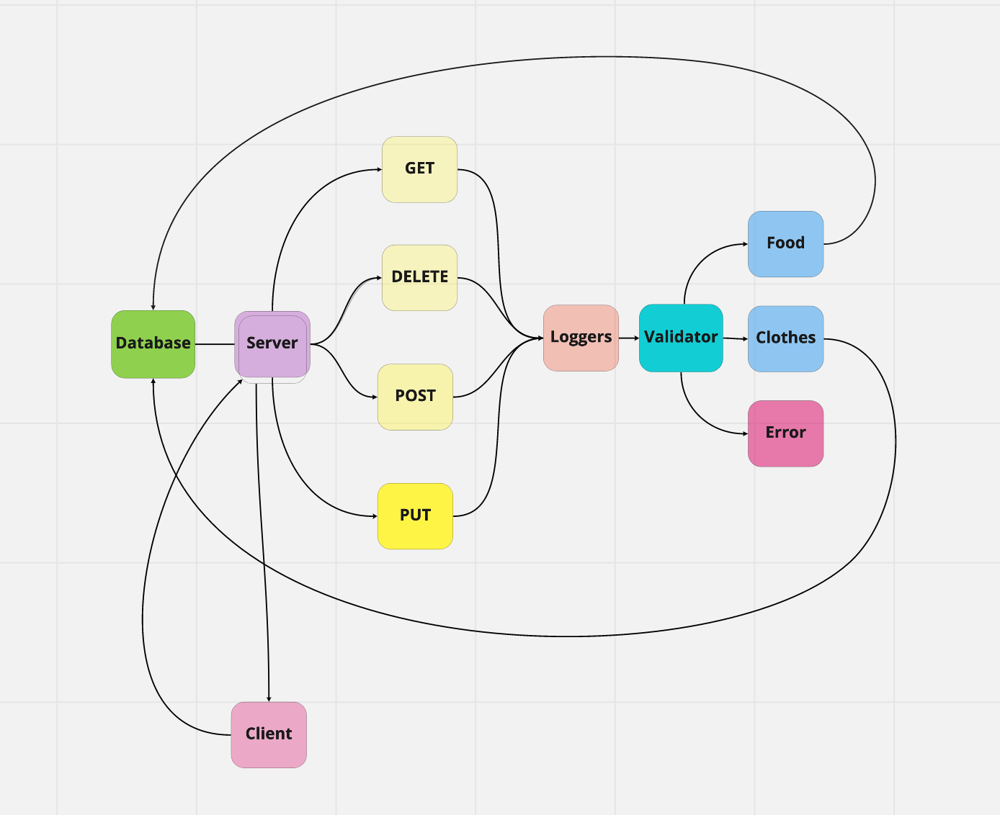

# basic-api-server

Created by Harvey Lucas

## Installation

```plaintext
> npm init -y
> npm install dotenv express jest supertest pg sequelize sequelize-cli sqlite3
```

## Summary of Problem Domain

### Lab: Class 03

Build a REST API using Express, by creating a proper series of endpoints that perform CRUD operations on a database, using the REST standard

## Links to application deployment

Heroku main branch deploy: https://tripppdx-basic-api-server.herokuapp.com/

## Visual



## Routes

- HTTP GET

  - Path: /person
    - responds with the string used in request query `?name=string`.

- HTTP GET

  - Path: /food ; /clothes
    - Returns: An array of objects, each object being one entry from the database.

- HTTP GET

  - Path: /food/1 ; /clothes/1
    - Returns: The object from the database, which has the id matching that which is in the path.

- HTTP POST

  - Path: /food ; /clothes
    - Returns: The record that was added to the database.

- HTTP PUT

  - Path: /food ; /clothes
    - Returns: The object from the database, which has the id matching that which is in the path, with the updated/changed data.

- HTTP DELETE
  - Path: /food/1 ; /clothes/1
    - Returns: The record from the database as it exists after you delete it (i.e. null)
