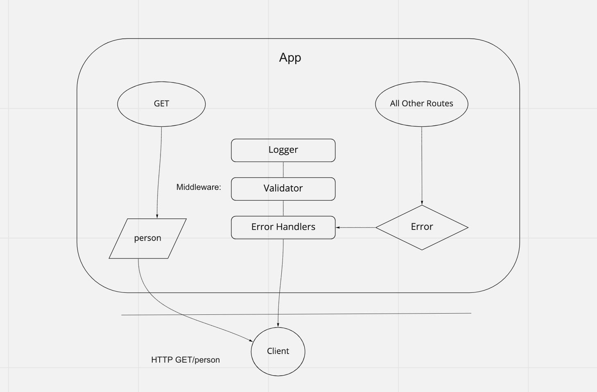

# basic-express-server

Created by Harvey Lucas

## Installation

```plaintext
> npm init -y
> npm install dotenv express jest supertest
```

## Summary of Problem Domain

### Lab: Class 02

Create and deploy a basic web server. Server should respond to a GET request.

## Links to application deployment

Heroku main branch deploy: https://tripppdx-basic-express-server.herokuapp.com/

## Visual



## Routes

- HTTP GET
  - Path: /person
    - responds with the string used in request query `?name=string`.
